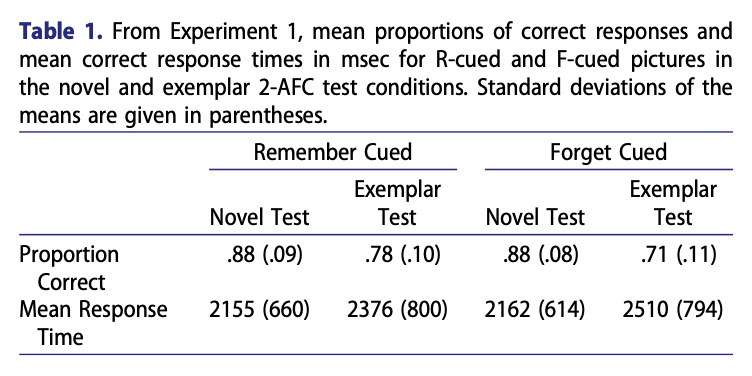

```{r setup, include=FALSE}
knitr::opts_chunk$set(echo = FALSE)
```

# Can people decide to forget images?

Directed forgetting research investigates the extent to which people can voluntarily decide to forget information. Prior research has focused mainly on directed forgetting for word stimuli.

We are interested in whether people can direct themselves to forget information that is more memorable than word stimuli. For example, visual images are known to be more memorable than words. 

## Ahmad, Tan, & Hockley (2019)

A recent study investigated directed forgetting for pictures of natural scenes. Their method and results are shown below.


```{r, out.width="80%"}

```

```{r, out.width="80%"}

```


- They found a small directed forgetting effect. 
- The effect was only observed for items given a more difficult recognition test, involving a similar (exemplar) lure.

<br>
<br>

# Is directed forgetting easier for less memorable images?

## Predictions

```{r, out.width = '50%'}
power <- new.env()
load("../vignettes/data/power.RData", power)
power$power_analysis$prediction_graph
```

# Experiment 1: Mixed


# Results

```{r, out.width = '50%'}
E1 <- new.env()
load("../vignettes/data/E1/E1_data_write_up.RData", E1)
E1$Accuracy$graphs$figure
```


# Experiment 2: Blocked

# Results

```{r, out.width = '50%'}
E2 <- new.env()
load("../vignettes/data/E2/E2_data_write_up.RData", E2)
E2$Accuracy$graphs$figure
```

# Next Steps


# Conclusion

Try `posterdown` out! Hopefully you like it!

```{r, include=FALSE}
knitr::write_bib(c('knitr','rmarkdown','posterdown','pagedown'), 'packages.bib')
```

# References
