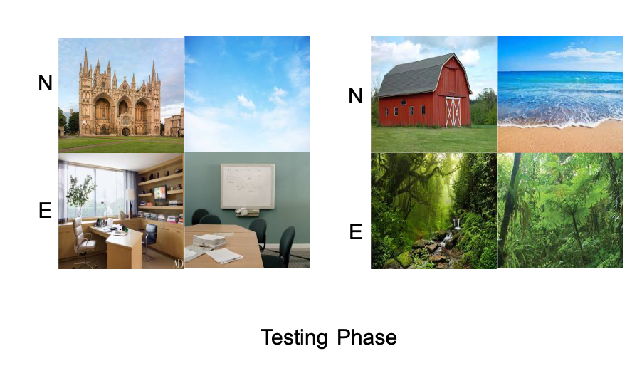

```{r setup, include=FALSE}
knitr::opts_chunk$set(echo = FALSE,
                      fig.align = "center",
                      out.width = "80%")
library(fontawesome)
```

# What is directed forgetting?

- Directed forgetting Effect (DFE) is the ability to selectively remember and forget events

- Has been shown to exist across a number of stimuli, but what about inherently memorable stimuli (i.e. image stimuli)

# Ahmad, Tan & Hockley (2019)

>- Investigated participant's ability to selectively remember or forget images.

:::: {.row}
::: {.col-md-6}

```{r}
knitr::include_graphics("imgs/Tan_methods.png")
```

:::

::: {.col-md-6}


```{r}

```

:::
::::

# Ahmad, Tan & Hockley (2019) Results

```{r, out.width = "50%"}
knitr::include_graphics("imgs/Tan_results.png")
```

>- Small directed forgetting effect for exemplar lures


# Experiment 1 

>- To identify which conditions increase DFE magnitudes for images, we weakened the image stimuli memorability. 

# Predictions

```{r}
power <- new.env()
load("../../vignettes/data/power.RData", envir = power)
power$power_analysis$prediction_graph
```


# Methods

# Accuracy Results

```{r}
E1 <- new.env()
load("../../vignettes/data/E1/E1_data_write_up.RData", envir = E1)
E1$Accuracy$graphs$figure
```

# RT Results

```{r}
E1$RT$graphs$figure
```

# Discussion

# Experiment 2

# Methods

# Accuracy Results

```{r}
E2 <- new.env()
load("../../vignettes/data/E2/E2_data_write_up.RData", envir = E2)
E2$Accuracy$graphs$figure
```

# RT Results

```{r}
E2$RT$graphs$figure
```

# General Discussion

# Conclusion

# Thank you {.middle .center}


